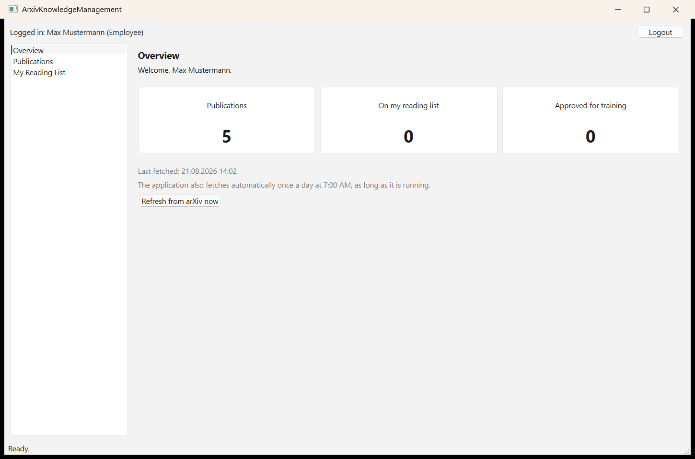
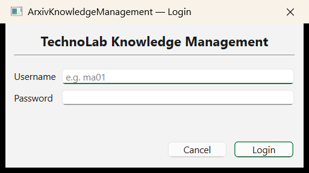
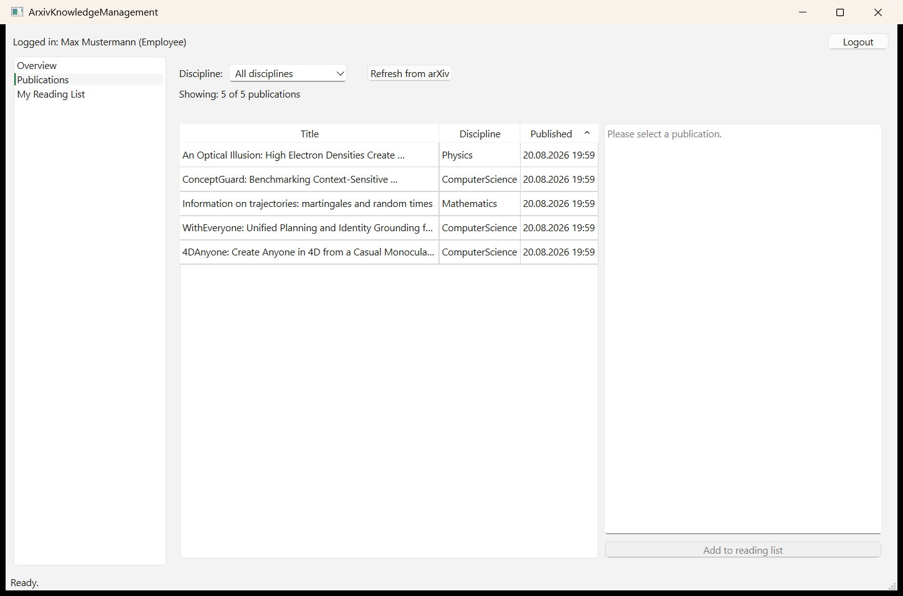
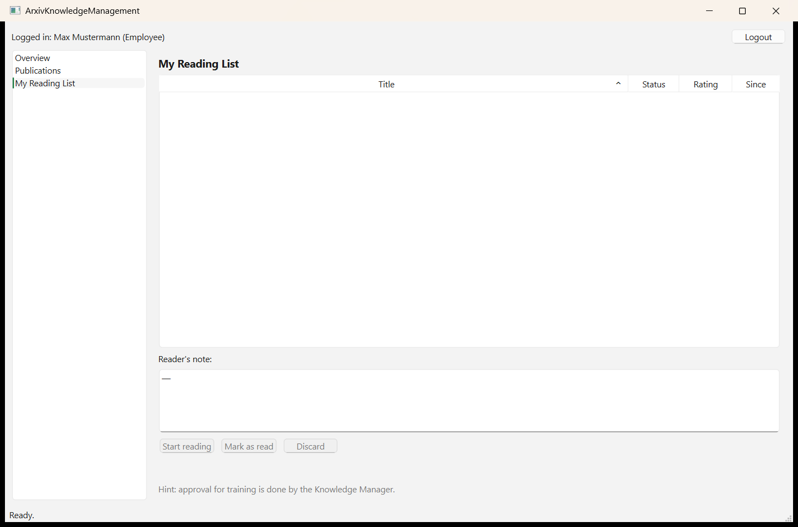

# ArxivKnowledgeManagement

A small desktop application for tracking scientific publications from arXiv through an
internal knowledge-management workflow: import, personal reading list, review, and
approval for internal training sessions.

This started as a school project (BWS — "Designing and Developing User Interfaces") and
is built with C++20 and Qt 6 Widgets.



## What it does

- Fetches the newest publications from the official [arXiv API](https://arxiv.org/help/api)
  (never scrapes the HTML pages — arXiv's `robots.txt` disallows that)
- Fetches automatically once a day at 07:00 local time while the app is running, and
  additionally at any time via a manual "Refresh" click
- Filters publications by discipline
- Lets each employee keep a personal reading list that moves through a fixed process:

  ```
  Import from arXiv → NOTED → IN_PROGRESS → READ → APPROVED_FOR_TRAINING → ARCHIVED
  ```

- Requires a Knowledge Manager (not the reader) to approve a paper before it counts as
  cleared for internal training
- Enforces three roles with real, tested permission checks — not just hidden buttons:

  | Role | May |
  |---|---|
  | Employee | Search/import papers, maintain their own reading list, move status up to READ |
  | Knowledge Manager | + view every reading list, approve papers for training, archive |
  | Administrator | + create/edit/deactivate users, assign roles |

## Architecture

Strict MVC, enforced at the build-system level rather than just by convention: the
model and controller CMake targets never link against `Qt6::Widgets`, so a stray
`#include <QWidget>` in the model fails to compile.

```
src/
  model/       Data + business logic. No Qt Widgets, ever.
  view/        Presentation only. No SQL, no network calls, no business logic.
  controller/  The only place a view and the model meet.
  app/         main.cpp — composition root.
```

See [`docs/05_architecture_mvc.md`](docs/05_architecture_mvc.md) for a fully traced
data flow through all three layers.

## Building

Requirements: Qt 6.10, CMake, Ninja, a C++20 compiler (developed against MinGW 13.1 on
Windows).

```bash
cmake -S . -B build -G Ninja -DCMAKE_PREFIX_PATH=/path/to/Qt/6.10.0/<kit>
cmake --build build
ctest --test-dir build --output-on-failure
```

16 automated test suites cover the model, controller, and an end-to-end acceptance test
driven against real widgets (no mocked UI layer).

## Screenshots

| Login | Publications | My Reading List |
|---|---|---|
|  |  |  |

## Getting started

See [`docs/user_guide.md`](docs/user_guide.md).

Test accounts (starting password `start1234` for all three):

| Username | Role |
|---|---|
| `ma01` | Employee |
| `wm01` | Knowledge Manager |
| `admin01` | Administrator |

## Documentation

Process analysis, user stories, backlog, UI design, architecture, sprint log,
acceptance test, and technology justification all live in [`docs/`](docs/).
